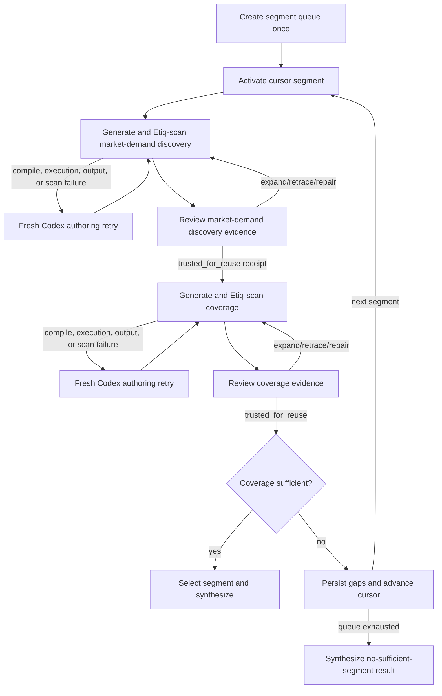

# Use-Case and ICP Agent — Repository Implementation Plan

## 1. Status and intent

This document is now the design baseline for the implemented MVP. The repository contains the synchronous workflow, adapters, durable artifacts, reviews, CLI, dashboard, and deterministic tests. The later hardening items and broader acceptance matrix remain a roadmap rather than claims about the current MVP.

The plan is derived from the supplied Etiq/Codex plan, job-dashboard and lineage screenshots, the segment/market-demand/coverage loop diagram, the attached `Etiq syntax.md`, and these current official Etiq pages:

- [Core Concepts](https://docs.etiq.ai/core-concepts)
- [Working with Scan Results](https://docs.etiq.ai/working-with-scan-results)
- [Agentic Workflows](https://docs.etiq.ai/agentic-workflows)

The Etiq-specific portions were revised on 2026-07-21 to use documented `CodeScannerResult` methods and state fields. The review-boundary, section-construction, and trusted-frontier portions were revised on 2026-07-22 after inspecting the corresponding contracts, runtime code, and tests in the local `marketing_claw` repository. The implementation pins the stable `etiq-copilot==2.3.0` release from PyPI. A real compatibility scan verified structured state retrieval, state IDs, `parent`/`children`, `parent_func_mapping`, function arguments, function IDs, and nested `func_stack`; the serializer stores the corresponding state nodes, function-mapping nodes, and captured relationships with resolvable endpoints. JSON lineage generation remains outside the implementation path because it is known to fail in target environments.

The market-demand prompt and review criteria were revised on 2026-07-23 using current marketing prompt patterns from [OpenAI's marketing examples](https://academy.openai.com/en/public/clubs/work-users-ynjqu/resources/use-cases-marketing), [HubSpot's market-research guide](https://offers.hubspot.com/view/market-research-kit), [Product Marketing Alliance's positioning framework](https://www.productmarketingalliance.com/pmm-power-prompts-positioning-and-messaging/), and a concrete [search-based pain-point mining prompt](https://www.zangwei.dev/prompts/product-research/user-pain-point-complaint-research-prompt). The resulting contract prioritizes observed jobs, pain, triggers, alternatives, consequences, desired outcomes, and authentic audience language over generic feature mentions or keyword matches.

## 2. Target outcome

Build a local-first Python application that accepts:

- a product or technology description;
- a general target audience; and
- an optional maximum number of candidate segments.

It will run a bounded Codex-driven workflow that:

1. creates one ordered segment queue;
2. conducts market-demand discovery for the active segment;
3. executes every generated market-demand or coverage pipeline through Etiq;
4. reviews the relevant Etiq evidence and either expands, retraces, repairs, resumes, or fails;
5. assesses trusted market-demand findings against product capabilities;
6. advances to the next existing segment only when coverage is trusted but insufficient; and
7. produces either a supported use-case/ICP synthesis or a clearly labelled `no_sufficient_segment` result.

The same application process will host the orchestration and the local dashboard. Codex invocations and Etiq scan sessions may run as supervised child processes for isolation, but they are implementation details of one workflow, not separate services.

## 3. Fixed design decisions

### 3.1 Workflow model

There are exactly five logical job types:

1. `segment`
2. `market_demand`
3. `coverage`
4. `synthesis`
5. `review`

`expand`, `retrace`, `repair`, and `resume` are review operations, not job types. A repair creates a new version of the affected market-demand or coverage run and returns to the same review loop. A pre-review authoring retry is different: when a generated pipeline cannot compile, execute, emit its runtime contract, or produce reviewable Etiq evidence, a fresh Codex session rewrites the complete pipeline before any review occurs.

### 3.2 Execution authority

- Codex generates structured outputs, including a proposed pipeline file bundle or a scoped repair.
- The workflow validates and writes generated artifacts.
- The workflow is the only component allowed to initiate generated-pipeline execution.
- The declared entry-file source is passed to `DebuggerCodeScanner().scan_code(code_str=...)` from the generated pipeline's run directory; it is never launched as `python pipeline.py`.
- A non-zero Codex exit, malformed structured response, Etiq scan error, or missing evidence fails closed and cannot create a trusted receipt.

Returning a bounded pipeline file bundle through Codex's final structured response is preferred over allowing a Codex job to write and run files itself. The workflow rejects absolute paths, parent traversal, and undeclared files before materializing the bundle. This makes the Etiq-only execution rule enforceable rather than prompt-only.

### 3.3 Evidence authority

- The primary execution-evidence artifact is a complete serialization of the nodes and relationships Etiq captured in the live `CodeScannerResult`.
- Persist every captured node used by Etiq and every Etiq-provided relationship between those nodes, including direction and relationship/function-mapping metadata exposed by the pinned version.
- `result.create_full_lineage_graph(graph_format="json")` is not part of the implementation path because it raises `AssertionError` in the target Etiq environment.
- DOT returned by `result.create_full_lineage_graph()` may be retained as an optional diagnostic, but it is not the evidence authority or the source used by review/UI navigation.
- No custom lineage, AST-derived graph, dependency graph, inferred node, or inferred edge is created.
- The persistence schema is only a serialization envelope around captured Etiq nodes and relationships. It must not calculate, replace, merge, or add edges.
- A thin navigator may index run-scoped node references and select existing Etiq-captured neighborhoods for display, while preserving exact endpoints, direction, relationship kind, and raw metadata.
- Stage/helper labels, boundary classifications, section membership, ordering, and trust are derived review annotations over the captured snapshot, not additional execution-evidence nodes or edges. Every such annotation records the exact captured node and relationship references that support it.
- A captured relationship that crosses adjacent `func_stack` prefixes may be classified for review as a consumed input or caller-visible output, but the classifier must preserve and cite the original relationship rather than writing a replacement `consumes` or `produces` edge.
- Node/relationship references are scoped by `run_id`. They are never treated as durable identities or correlated across repair versions without an explicit workflow artifact link.
- AST parsing may be used only for syntax validation or to constrain a repair to an approved source span; it must not be used to derive lineage.
- Semantic annotations explain business meaning but never establish execution relationships.

### 3.4 Persistence and UI

- The MVP is a local, single-user application.
- Durable state is stored as versioned JSON artifacts plus an append-only JSONL event log under `outputs/jobs/<job_id>/`.
- Writes use temporary files plus atomic replacement so the UI never reads partial state.
- A server-rendered Python UI with small polling-based updates is preferred for the screenshot-aligned interface. FastAPI, Jinja, and minimal JavaScript are the proposed stack; this remains one application rather than a frontend/backend service split.
- The default auto-refresh interval is 15 seconds while a job is active.

## 4. Proposed repository layout

```text
use_case_icp/
├── src/use_case_icp/
│   ├── __init__.py
│   ├── __main__.py              # CLI entry point
│   ├── records.py               # durable dataclass records
│   ├── job_store.py             # snapshots, events, artifacts, canonical paths
│   ├── codex_runner.py          # supervised `codex exec` adapter
│   ├── etiq_executor.py         # sole generated-pipeline scan boundary
│   ├── etiq_graph.py            # captured node/relationship serialization
│   ├── review.py                # function-based section and receipt logic
│   ├── workflow.py              # top-level workflow/state machine
│   └── dashboard.py             # local routes and view models
├── prompts/
│   ├── pipeline_instruction.md
│   ├── segment.md
│   ├── market_demand.md
│   ├── coverage.md
│   ├── review.md
│   └── synthesis.md
├── schemas/                     # JSON Schemas supplied to Codex
│   ├── segment.schema.json
│   ├── market_demand.schema.json
│   ├── coverage.schema.json
│   ├── review.schema.json
│   ├── review-section.schema.json
│   ├── node-review.schema.json
│   ├── section-receipt.schema.json
│   └── synthesis.schema.json
├── templates/
│   ├── dashboard.html
│   ├── job.html
│   └── lineage.html
├── static/
│   ├── app.css
│   └── app.js
├── tests/
│   ├── fixtures/
│   │   ├── codex/
│   │   └── etiq/
│   ├── unit/
│   ├── integration/
│   └── e2e/
├── outputs/jobs/                # ignored runtime artifacts
├── pyproject.toml
├── README.md
└── IMPLEMENTATION_PLAN.md
```

Runtime artifacts for each job and stage are versioned rather than overwritten:

```text
outputs/jobs/<job_id>/
├── request.json
├── state.json
├── segments.json
├── events.jsonl
├── invocations/<invocation_id>/
│   ├── context-manifest.json      # exact durable context selection and hashes
│   ├── agent-request.json         # fully assembled prompt/input
│   ├── codex-events.jsonl
│   ├── usage.json                 # reported input/output token usage
│   └── agent-output.json
├── stages/<segment_id>/<stage>/runs/<run_id>/
│   ├── codex-invocation-ref.json  # reference to the producing fresh invocation
│   ├── pipeline/                 # Python entry file plus optional local helpers
│   ├── etiq-nodes.json           # direct snapshot of captured nodes
│   ├── etiq-relationships.json   # direct snapshot of captured relationships
│   ├── etiq-raw.dot             # optional
│   ├── etiq-scan-errors.json
│   ├── etiq-inventory.json
│   ├── review-boundaries.json     # annotations referencing captured evidence
│   ├── review-sections.json
│   └── annotation.json
├── review/section-inputs/<section_id>.json
├── review/decisions/<section_id>/<unit_id>.json
├── receipts/<section_id>.json
├── usage-summary.json             # job rollup across fresh invocations
└── final/result.json
```

## 5. Core data contracts

Implement and version the following schemas before orchestration logic:

### 5.1 Request and job state

- `AgentRequest`: product description, audience, optional segment cap, explicit segmentation criteria, source policy, and runtime limits.
- `RootJobState`: job ID, lifecycle status, active segment, segment cursor, authoring-retry count, repair count, timestamps, last error, and final artifact reference.
- `JobEvent`: monotonic sequence number, timestamp, event type, stage, segment, run ID, severity, summary, and artifact references.
- `CodexContextManifest`: invocation ID, job/operation purpose, `fresh_session: true`, selected durable artifact references, delivery mode (`embedded` or readable workspace reference), hashes, excluded references and reasons, prompt/instruction/schema versions and hashes, context budget, and optional provenance link to the invocation that caused this one. The provenance link never resumes or imports conversational state.
- `CodexUsageRecord`: invocation ID, job/operation purpose, terminal status, usage status (`reported` or `unavailable`), reported input tokens, reported output tokens, reported total tokens, any additional usage categories exposed by the installed CLI, source event reference, and timestamp. Write it for successful, failed, and timed-out invocations. Missing CLI usage is recorded as unavailable, never presented as zero or estimated actual usage.
- `JobUsageSummary`: sums reported input/output/total tokens by job type and for the whole root job, while separately counting invocations whose usage was unavailable so partial totals are visibly incomplete.

### 5.2 Segments

- `Segment`: ID, name, definition, inclusion/exclusion criteria, initial fit reason, rank, and one of `pending`, `active`, `processed_insufficient`, `selected`, or `skipped`.
- `segments.json`: ordered segment records plus the input fingerprint. Active segment and cursor state live only in `RootJobState`.
- The input fingerprint covers the product, audience, and explicit segmentation criteria. Only a changed fingerprint authorizes a new segmentation run.

### 5.3 Stage outputs

- `GeneratedPipeline`: one safe relative Python entry-file path and a bounded list containing only safe relative `.py` files and source text. The materialized manifest records per-file hashes and a manifest hash. The minimal bundle contains `pipeline.py`.
- `MarketDemandResult`: needs, workflows, structured demand signals, assumptions, research gaps, generated pipeline bundle, and semantic annotation. Each signal keeps its audience, job, context, pain, trigger, current alternative, consequence, observed evidence, source, signal type, confidence, and limitations.
- `CoverageResult`: need-to-capability mappings, supported/partial/unsupported classification, candidate use cases, preliminary ICP traits, gaps, sufficiency recommendation, generated pipeline bundle, and annotation.
- `SynthesisResult`: ranked use cases, user, buyer, company profile, trigger workflow, supporting evidence references, capabilities, gaps, confidence, and outcome mode.

### 5.4 Execution evidence

- `StageRun`: immutable run/version identity, parent run when repaired, failed-attempt link when rewritten before review, Codex invocation result, pipeline manifest hash, Etiq artifact references, scan status, and review state.
- `EtiqNodeRecord`: run-scoped storage reference plus the Etiq-captured fields exposed by the pinned version for lineage-object, function, assignment, or other code nodes. Where applicable this includes names, line number, node/state/value type, object category, exact `func_stack` frames, source snippet, scope type, raw node metadata, and a reference to any separately captured value.
- `EtiqRelationshipRecord`: run-scoped source and target node references, Etiq-provided direction, relationship/function-mapping kind, and raw relationship metadata. A record is written only when that relationship is present in Etiq's result.
- `EtiqEvidenceSnapshot`: schema/version metadata and references to the complete node and relationship artifacts for one scan run. It is a persistence envelope, not an independently derived graph.
- `EtiqInventory`: results of `list_dataframes()`, `list_models()`, `list_agents()`, plus run-scoped references to `get_dataframes()`, `get_models()`, `get_agent_states()`, and `get_unstructured_states()`.
- `EvidenceSelection`: run ID, evidence snapshot ID, selected run-scoped node references, exact selected function-stack prefix, the incident Etiq relationship records, collapsed child frames, and source evidence.
- Evidence selections reference stored nodes and relationships; they do not copy them into a rewritten graph model.
- `EvidenceReviewUnit`: one observed function scope per run, its exact `func_stack` prefix, supporting captured node/relationship references, classified boundary inputs/outputs, collapsed helper-frame index, ordering evidence, and `BoundaryHealth`. Its `unit_id` is not an Etiq node ID.
- `BoundaryHealth`: observed grouping mode, captured input/output counts, invocation information, ordering source, execution-evidence findings, and a `degraded` flag. It is calculated only from the executed Etiq result.

### 5.5 Review contracts

- `ReviewSection`: deterministic section ID, ordered assigned unit IDs, overlap-only context unit IDs, ordinals, context budget, and complete section-input hash.
- `ReviewPackage`: one section, its full assigned stage review units, bounded overlap context, supporting semantic context, explicitly excluded evidence, and prior judgment state.
- `ExpectationRecord`: acceptance criteria written for an assigned stage before its produced outputs are inspected.
- `ReviewDecision`: unit ID, decision (`trusted`, `failed`, `suspect`, `superseded`, or `not_pipeline_step`), trust level when trusted, criterion outcomes with evidence references, boundary-health acknowledgement, rationale, and reviewer provenance.
- `ReviewReceipt`: immutable, hash-bound section result (`passed`, `blocked_for_repair`, or `rejected`), ordered reviewed selections, authoritative reviewer provenance, per-path last trusted selections, first failed/suspect selections, invalidated downstream selections, and next action.
- `TrustAnnotation`: append-only authoritative or proposed node judgment. Only a validated Codex review receipt may create an authoritative annotation; worker output remains a proposal.
- `CoverageJudgment`: a separate `sufficient`/`insufficient` decision that is legal only after a valid trusted coverage receipt exists.

Trusted `ReviewDecision` records use exactly one graded level:

- `trusted_for_reuse`: all criteria are met with resolvable criterion-level evidence; only this level may satisfy a downstream execution guard.
- `trusted_for_reporting`: suitable for reporting, but downstream work must recheck it and may not treat it as reusable input.
- `provisionally_trusted`: current evidence has known gaps; it may not advance reusable execution and decays to `suspect` if its evidence references stop resolving.

Every stored object includes `schema_version`. Unknown newer versions must be rejected rather than silently interpreted.

## 6. State-machine invariants

The workflow will encode transitions explicitly rather than relying on prompt text.



Required guards:

- Every Codex invocation has a new invocation/session ID and receives all permitted context explicitly from durable artifacts; no transition depends on prior conversational memory.
- The cursor never advances while market-demand discovery or coverage lacks `trusted_for_reuse` receipts for every required active-path dependency.
- `expand` and `retrace` do not create a new pipeline run by themselves.
- `repair` creates a child run, invokes Etiq again, and invalidates any receipt for the superseded run.
- Compilation failures, execution failures, invalid runtime output, scan errors, and zero-node scans never enter review. They trigger a bounded fresh-session Codex authoring retry with the failed source and persisted diagnostics.
- Authoring retries and evidence-review repairs have separate counters and limits. An authoring retry never increments the repair count.
- Market-demand discovery must be `trusted_for_reuse` before coverage can start.
- Coverage trust and coverage sufficiency are separate stored decisions; only `trusted_for_reuse` coverage may be judged sufficient or insufficient for queue advancement.
- Trusted but insufficient coverage retains market-demand discovery evidence, uncovered needs, and gaps before advancing.
- Moving to the next segment uses the existing queue and does not rerun segmentation.
- Trusted and sufficient coverage selects exactly one segment and stops queue advancement.
- Queue exhaustion produces only `no_sufficient_segment`; it cannot claim a validated ICP.
- Configured iteration, repair, time, or cost limits transition to `failed`/human review without pretending the current boundary is trusted.

## 7. Codex job boundary

Create one `CodexRunner` adapter used by every logical job.

Planned invocation behavior:

- start every invocation as a new, non-resumed `codex exec` session with a new invocation ID;
- never pass a prior Codex session/conversation ID or use CLI resume for a job, review pass, or repair;
- set the job workspace explicitly;
- stream `--json` JSONL events into the run artifact directory;
- extract the installed CLI's reported input/output token usage into `usage.json` and refresh the root `usage-summary.json`;
- enforce the job-specific `--output-schema`;
- capture the last message separately for diagnostics;
- use a configurable model/profile rather than hard-coding a model slug;
- default agent jobs to the narrowest sandbox compatible with the task;
- apply timeouts and terminate the child process cleanly;
- parse the final structured payload only after a successful exit; and
- redact secrets from persisted prompts and process diagnostics.

The locally installed CLI currently exposes `--json`, `--output-schema`, `--output-last-message`, `--cd`, sandbox selection, profiles, and resumable executions. The adapter deliberately does not use resumable execution for this workflow. It wraps the other capabilities and covers the installed version with a startup compatibility check.

### 7.1 Generated-Python pipeline instruction

This is the shared Codex instruction for pipeline creation. It is included in every market-demand, coverage, pre-review pipeline-retry, and pipeline-repair prompt. It also applies to synthesis only if synthesis is later made a generated pipeline. Segment creation and review judgment are not pipeline-generation jobs.

Codex must return a bounded Python pipeline bundle, not another workflow language or an instruction to execute the pipeline itself. The pipeline should:

- contain a clear Python entry file, normally `pipeline.py`;
- organize meaningful pipeline stages as clearly and consistently named Python functions so their executed nesting is understandable in Etiq;
- keep stage names stable during a repair when the stage still represents the same work; and
- produce the output requested by the job.

Function names help organize the review, but they do not establish evidence quality. Only the executed Etiq result can show whether a review boundary exists and whether that observed boundary is healthy.

### 7.2 Fresh-session context assembly

Every Codex invocation starts without conversational memory. The workflow reconstructs a complete, bounded context package from durable artifacts and writes `context-manifest.json` before invocation. A job must not rely on anything Codex saw in an earlier session.

Every context package contains:

- the job or review objective and authorized actions;
- the relevant portion of the original request and current workflow state;
- the shared Python-pipeline instruction when creating or repairing a pipeline;
- validated upstream outputs, receipts, evidence, or repair history needed for this invocation;
- explicit artifact references and hashes so the supplied context can be audited;
- excluded context references and reasons, treated as known unknowns;
- the input and output contracts; and
- the exact response schema and context budget.

Selected artifact content is either embedded within the bounded request or exposed through an explicit read-only workspace reference. The manifest records which method was used and the content hash; a hash or filename alone is never treated as having supplied the context.

Context is selected by purpose:

- `segment`: the root request, segmentation criteria, source policy, and limits;
- `market_demand`: the root product/audience context, active segment, retained gaps, source policy, and relevant segment output;
- `coverage`: the root product context, active segment, reusable-trusted market-demand artifacts and receipts, and retained gaps;
- `synthesis`: the selected segment and reusable-trusted market-demand/coverage artifacts and receipts, or the exhausted-queue evidence for the negative mode;
- `review`: the immutable section review package described in Section 10.1; and
- `pipeline authoring retry`: the complete failed pipeline source, runtime input and required output keys, failed run ID, failure phase, exception, stdout, stderr, execution error, and Etiq scan diagnostics;
- `repair`: the affected pipeline source, suspect/failed evidence, repair fork point, approved source scope, relevant receipts, and requested change.

Each segment, market-demand discovery, coverage, pipeline authoring retry, synthesis, repair, and section-review invocation receives a new session. Workflow operations do not reuse sessions either:

- `expand` and `retrace` are performed by the workflow over stored/live Etiq evidence; any subsequent Codex review is a new section-review session with the expanded package;
- workflow `resume` means state-machine continuation, never Codex CLI session resume;
- `failed` records state and does not require another Codex session; and
- `pipeline authoring retry` always starts a new Codex session and returns a complete replacement pipeline, followed by a new versioned Etiq execution attempt; and
- `repair` always starts a new Codex session, followed by a new scan and new review sessions.

The workflow passes an explicit model for every session rather than inheriting the user's global Codex default. The workflow default is `gpt-5.5`, and the CLI rejects GPT model versions above 5.5; a caller may deliberately select an available lower version with `--model`.

Prompt templates and the shared pipeline instruction are versioned artifacts. Each invocation records their versions and hashes in its context manifest. Job-specific prompts may add requirements relevant to that invocation.

Actual session usage is recorded separately from the context budget. The budget is a pre-run limit; `usage.json` contains only usage reported by the Codex CLI after or during that invocation.

## 8. Etiq execution and navigation boundary

### 8.1 Documented scan contract

Create one `EtiqExecutor.execute(pipeline_bundle, run_context)` method that:

1. validates the bounded relative file manifest, materializes it in an isolated run directory, and records all hashes;
2. reads the declared entry file and performs syntax-only validation of every Python file without executing it;
3. changes the scan-session working directory to the bundle root, creates `DebuggerCodeScanner()`, and calls `scan_code(code_str=entry_source)` exactly once for the run version;
4. treats a truthy/non-empty `result.scan_errors` as blocking before drawing any conclusion;
5. retrieves, merges, and deduplicates captured states from `get_dataframes()`, `get_models()`, `get_agent_states()`, and `get_unstructured_states()`, plus every additional function/code node exposed by Etiq's pinned-version relationship/function mappings;
6. enumerates and serializes the parent/child and function-mapping relationships captured by Etiq, using the pinned version's verified accessors/fields;
7. validates that every stored relationship endpoint resolves to a stored node from the same run, without adding missing edges;
8. optionally obtains DOT with `result.create_full_lineage_graph()` for diagnostics or export;
9. inventories documented dataframe, model, agent, and unstructured state categories; and
10. serializes the complete captured result before the isolated worker exits; review reads only those durable artifacts.

Do not call `create_full_lineage_graph(graph_format="json")` in production, review, UI, or test-fixture generation. The target environment raises `AssertionError` for that call. The adapter startup check records JSON lineage as unsupported and proceeds through the captured-node/relationship path.

Implementation API map:

| Need | Documented Etiq API/field | Planned use |
|---|---|---|
| Execute and observe entry source | `DebuggerCodeScanner().scan_code(code_str=...)` | Sole generated-pipeline scan boundary |
| Block invalid evidence | `result.scan_errors` | Checked before node/relationship interpretation |
| Captured lineage-object states | `get_dataframes()`, `get_models()`, `get_agent_states()`, `get_unstructured_states()` | Category-specific dataframe/model/agent/unstructured node evidence, merged by captured state ID |
| Function/code nodes and relationships | Pinned-version Etiq relationship and function-mapping fields/accessors, verified in Phase 0 | Remaining node evidence and all relationship evidence, copied exactly |
| Optional visual export | `result.create_full_lineage_graph()` | DOT diagnostic/download only; never evidence authority |
| Unsupported JSON lineage | `result.create_full_lineage_graph(graph_format="json")` | Do not call; known `AssertionError` |
| Function nesting | `state.func_stack` | Observed stage grouping, helper indexing, and level-by-level expansion |
| Dataframe inventory/state | `list_dataframes()`, `get_dataframes()` | Dataset/dataframe evidence |
| Model inventory/state | `list_models()`, `get_models()` | Model evidence |
| Agent inventory/state | `list_agents()`, `get_agent_states()` | Supported in-pipeline agent evidence |
| Other captured state | `get_unstructured_states()` | Unstructured evidence |
| Retrace path | Persisted Etiq relationship records | Walk the captured incoming edges without inventing relationships |
| Source evidence | `state.line_no`, `state.node.as_string()`, `state.node.scope()` | Detail panel and repair boundary |

The scanner executes the supplied source in a supervised child process with its own working directory and process group. The worker has a bounded environment, wall-clock timeout, and optional CPU/memory limits. This isolates lifecycle and failure, but is not presented as a complete security sandbox or network boundary.

### 8.2 Captured node and relationship evidence

For each unique lineage-object state returned by the documented category getters, create one `EtiqNodeRecord` containing only documented or verified Etiq fields:

- `state.names`;
- `state.line_no`;
- the state and runtime value type;
- `state.func_stack` when present;
- `state.node.as_string()`;
- `type(state.node).__name__`;
- `type(state.node.scope()).__name__`; and
- a run-scoped state ordinal/reference.

Also create `EtiqNodeRecord` entries for every function, assignment, or other code node that Etiq exposes through its relationship/function mappings. No single result collection is assumed to contain every node category that participates in Etiq's lineage. Phase 0 must prove how all relationship endpoints are enumerated and serialized for the pinned version.

For every relationship captured by Etiq, create one `EtiqRelationshipRecord` containing:

- the exact run-scoped source-node reference;
- the exact run-scoped target-node reference;
- the direction exposed by Etiq;
- the Etiq relationship or function-mapping type;
- any raw Etiq relationship metadata needed to preserve its meaning; and
- the pinned Etiq version and serializer version.

The serializer must not infer relationships from names, `func_stack`, line order, source code, AST structure, shared values, or DOT parsing. `func_stack` is used only for captured nesting, stage/helper selection, and view grouping; it never creates an execution relationship. Phase 0 must identify the actual relationship accessors/fields in the installed Etiq version and demonstrate that the persisted relationship count and endpoints match the live result.

Use the documented category APIs as follows:

- `list_dataframes()` for dataframe names and `get_dataframes()` for dataframe state objects;
- `list_models()` and `get_models()` for model evidence;
- `list_agents()` and `get_agent_states()` for agent evidence; and
- `get_unstructured_states()` for captured states outside the other categories.

Full runtime values can be large or sensitive. Persist only a small type-aware preview: at most five dataframe rows and twenty columns/items, sensitive-key redaction, a 2,000-character cap, and an explicit truncation flag. This value policy does not remove node or relationship identity from the evidence snapshot.

### 8.3 Nested-function drill-down

Use `state.func_stack` as the authoritative function-call nesting signal. The attached syntax example shows frames such as:

```text
('main', 'do_something,<call-id>', 'add_one,<call-id>')
```

The navigator will:

- group states by their exact run-scoped `func_stack` prefix;
- initially expose each observed stage invocation and collapse every deeper helper prefix beneath it;
- retain a bounded helper index containing every observed descendant prefix, while revealing only direct children at each UI expansion level;
- list only direct child frames when the user or review job expands a function;
- preserve the exact frame string within a run, including Etiq's call suffix;
- preserve repeated invocations as distinct run-scoped observations rather than merging frames by function name;
- never infer containment from indentation, an AST-built call graph, or matching names; and
- never use a function frame or node reference to correlate different scan versions.

The Phase 0 fixture must determine the stack-depth conventions for module state, top-level functions, repeated calls, recursion, and imported functions. UI code should use relative prefix depth, not a hard-coded stack length such as `3`.

### 8.4 Observed stage grouping and boundary classification

After a successful scan, group stage review units from the executed Etiq result:

1. Prefer the generated pipeline's declared highest meaningful stage functions and match them to observed Etiq `func_stack` frames.
2. If declarations are absent, use the captured wrapper/branch fallback so older pipeline payloads remain reviewable. A declared function that is not observed degrades the boundary and blocks reusable trust.
3. For each candidate, count its observed descendant frames, captured nodes, and incident captured relationships. If any configured review-unit limit is exceeded, recursively promote its boundary-bearing direct children and reassess them. Stop at a unit within limits, the configured relative-depth limit, or a branch with no splittable captured child boundary; reject an indivisible oversized unit before invoking Codex.
4. Persist the selected depth, counts, limits, and selection reason with every `EvidenceReviewUnit` so the nesting decision is inspectable.

Clearly named functions make these groups understandable, but names do not prove that a boundary exists or is healthy. Within an observed path, call suffixes remain part of run-scoped identity, so repeated calls are not merged by name.

For each selected exact stage prefix:

- select its supporting captured states and relationships;
- classify a captured relationship crossing between that prefix and its caller prefix as a boundary input or caller-visible output according to the verified Etiq direction and mapping semantics;
- cite the original relationship reference for every classification and never write a shortcut execution edge;
- collect deeper observed prefixes as collapsed helpers; and
- keep raw captured states available for inspection without making each raw state a separate first-pass review unit.

Attach `BoundaryHealth` to every stage review unit using only executed evidence: captured boundary counts, relationship endpoint resolution, invocation information, scan errors, and captured-flow ordering. Mark it degraded when the executed result has no resolvable boundary, contains unresolved relationship endpoints, or cannot establish usable ordering. Source style or function naming must never mark a boundary unhealthy. Boundary health and business-output quality remain separate signals.

### 8.5 Stage ordering and review-section construction

Function nesting determines which captured evidence forms a stage review unit; nesting depth does not determine section number. Construct review sections as follows:

1. Use only stored Etiq relationships to identify artifact/data flow between observed stage selections. Any transient stage-to-stage ordering relation records all captured relationship references that support it and is never persisted as an Etiq execution edge.
2. Topologically order the selected stages, using captured run ordinal and exact `func_stack` prefix only as deterministic tie-breaks between otherwise independent ready stages. Do not substitute source-line order for missing lineage.
3. If no usable captured ordering exists or a cycle prevents a complete order, record `ordering_source` as degraded. A source-position order may be rendered for diagnostics, but it cannot advance the trusted frontier.
4. Partition the ordered list into contiguous, dependency-coherent sections bounded by configured assigned-stage, captured-node, captured-relationship, helper-frame, and final serialized-package limits. Start a new section where adding the next unit would cross a bound or mixing graph-independent branches would cause one branch's receipt to block another. Section IDs are monotonic (`section-001`, `section-002`, and so on).
5. `assigned_unit_ids` are the only units the section may judge. `context_unit_ids` add upstream/downstream overlap only while the evidence bounds remain satisfied; explicitly record overlap excluded by the bounds.
6. Package the selected boundary-level evidence for assigned units and bounded overlap units. Deeper helpers remain indexed but collapsed until review requests one exact direct child. Persist available-versus-selected character, node, relationship, estimated-token, and reported-token counts. Excluded evidence is a known unknown and cannot support trust.
7. Hash the complete immutable section input and bind every review record and receipt to that hash. Reject a section that exceeds its budget rather than silently truncating mandatory evidence.

Independent branches may therefore be reviewed separately. A blocked section freezes only its graph descendants, not every later-numbered section.

### 8.6 Retrace and source evidence

Retrace walks backward over the stored Etiq-captured relationships from the suspect node. The isolated worker has already exited, so review does not depend on a live result object.

If a path is displayed or persisted:

- it must come directly from `get_shortest_path()` or the stored Etiq-captured relationship records;
- its direction and endpoint semantics must be verified in Phase 0 rather than assumed from argument names;
- every item is linked back to its run-scoped captured state; and
- no new edge is added when the method returns no path.

Use `state.node.as_string()` for the source snippet and `state.node.scope()` for module/function scope. Treat these as source evidence attached to a captured state, not as a second execution graph. Phase 0 must verify how source filenames and line numbers behave for imported modules because the current page documents line numbers and scope but does not establish a durable filename field.

### 8.7 Multi-file pipeline scans

For a multi-file generated pipeline:

- create one explicit entry file, normally `pipeline.py`;
- run the scan session from that run directory so local imports resolve;
- read and pass only the entry file source to `scan_code(code_str=...)`;
- let Etiq observe imported helper functions that actually execute; and
- do not scan helper modules separately or concatenate them into a custom synthetic source graph.

The evidence describes the executed path. A helper that was imported but never called must not be presented as observed execution.

### 8.8 Agent and unstructured lineage

Etiq captures both structured and unstructured lineage objects. The workflow retrieves those categories separately. Therefore:

- if an Etiq-scanned pipeline itself needs an agent call, prefer one of those supported libraries for the first implementation;
- assign agent inputs and outputs to meaningful variables so their lineage is reviewable;
- distinguish those in-pipeline agent states from the external Codex CLI process, whose JSONL events are operational records and are not claimed as Etiq agent lineage;
- use a deterministic `pydantic-ai` function model with external model requests disabled in the agent-capture test fixture; and
- configure JSON-shaped container types such as `dict` and `list` only on the isolated scanner instance used for the generated job, so ordinary Python pipeline boundaries are available through `get_unstructured_states()` without changing the generated pipeline or persistent Etiq parser configuration.

Only if an unsupported in-pipeline agent framework is required should the implementation use `AstParser`, `get_qname_from_object()`, `register_type()`, and `save_config()`. Register only the live agent object's qualified type, inspect `types_to_capture`, make the change idempotent, record it in the run manifest, and provide cleanup with `remove_type()`. Default implementation must not persistently mutate Etiq's parser configuration.

### 8.9 Scan-session lifetime and recovery

`get_shortest_path()` and state-object getters operate on the live `CodeScannerResult`. Keep that result inside the scan session until the run receives a review receipt, is superseded by repair, or fails.

Persist the complete Etiq node snapshot, complete Etiq relationship snapshot, inventories, source snippets, scan errors, and any requested path results as review evidence. Do not pickle `CodeScannerResult` unless Etiq explicitly documents a supported serialization contract.

If the scan-session worker is lost before review completes:

- retain the original persisted artifacts for forensics;
- mark the original run interrupted and untrusted;
- rescan the unchanged source as a new child/recovery run if policy permits; and
- review the new run without assuming node references, relationship references, or captured values match the interrupted run.

### 8.10 Compatibility gate

The documented method names above replace speculative API discovery. Phase 0 must verify the pinned package's node fields, relationship/function-mapping accessors, relationship direction, error shapes, function-stack behavior, shortest-path direction, value access, imported-source metadata, and agent capture. It must also record the known JSON-lineage `AssertionError` as an unsupported capability. Save minimal real node/relationship fixtures and document the pinned `etiq-copilot` version and supported Python range before the main workflow is built.

## 9. Functional job behavior

### 9.0 Application of the Python-pipeline instruction

Sections 9.2 and 9.3 invoke the shared Python-pipeline instruction in Section 7.1; they do not redefine it. Market-demand and coverage job schemas reject a generated bundle that is not a bounded Python pipeline. The review job judges only nodes and relationships Etiq actually captured; a business artifact absent from the evidence snapshot is labelled uncaptured rather than reconstructed semantically.

### 9.1 Segment job

- Run once per request fingerprint.
- Return distinct, decision-useful segments in ranked order.
- Treat ranking as a hypothesis, not trusted market evidence.
- Validate unique IDs, contiguous ranks, non-empty criteria, and the configured maximum.
- Persist and activate the first segment atomically.

### 9.2 Market-demand discovery job

- Receive the active segment, the original audience and product context, source policy, and relevant retained gaps from earlier insufficient segments.
- Research the audience's jobs, context, workflows, pain, triggers, alternatives, consequences, and desired outcomes before mapping anything to product capabilities.
- Prefer authentic practitioner, user, buyer, behavioural, and operational evidence. Treat vendor documentation and product pages as background or alternative evidence rather than sufficient proof of demand.
- Keep human builder/researcher evidence distinct from agent operational evidence, and preserve missing or contradictory evidence.
- Use approved source adapters with provenance, timeout, retry, and domain policy; never persist credentials.
- Process each retrieved source once into compact evidence records and use functions for meaningful research stages rather than high-volume sentence-level mechanics.
- Return a generated Python pipeline bundle following Section 7.1; any sibling semantic fields in the authoring response are provisional and non-authoritative.
- Perform source discovery and retrieval inside the Etiq-executed pipeline, emit exactly one structured JSON market-demand result on stdout, persist the authoring proposal separately, and use only the runtime result for market-demand review and downstream coverage.
- Materialize and scan the bundle's entry source through Etiq, then enter market-demand review.

### 9.3 Coverage job

- Require a trusted market-demand receipt.
- Map each trusted need to a capability from the supplied product description.
- Identify supported, partial, and unsupported needs and explicit coverage gaps.
- Return candidate use cases, preliminary ICP traits, and a generated Python pipeline bundle following Section 7.1; use the pipeline's single JSON stdout object as the authoritative coverage result and retain authoring-time siblings only for audit.
- Materialize and scan the bundle's entry source through Etiq, then enter coverage review.

### 9.4 Synthesis job

- In normal mode, require a selected segment plus trusted market-demand and coverage receipts.
- Rank use cases and produce the ICP with evidence references and limitations.
- In `no_sufficient_segment` mode, summarize best partial opportunities and gaps without presenting an ICP as validated.
- Synthesis consumes trusted artifacts; it does not create a new execution lineage unless future requirements explicitly add a synthesis pipeline.

## 10. Review loop

### 10.1 Section review package

Every review begins with one immutable, bounded section package containing:

- the original request, active segment, stage objective, expected output, current annotation, and retained gaps;
- the current run, scan errors, evidence mode, and fallback/degradation reason;
- the populated review frame: objective, success criteria, audience, constraints, evidence standard, intended downstream use, assumptions, limitations, and unresolved questions;
- every assigned `EvidenceReviewUnit`, including exact `func_stack` prefix, supporting captured nodes and relationships, classified inputs/outputs, captured values or hashes, `BoundaryHealth`, collapsed helper index, source evidence, and prior judgment state;
- overlap-only boundary/context units clearly separated from assigned units;
- the trusted, suspect, and failed selections relevant to the section and its dependencies;
- prior receipts and repairs for the same stage checkpoints;
- supporting semantic context selected by priority;
- excluded references and exclusion reasons, treated as known unknowns; and
- token accounting and the complete section-input hash.

Raw Etiq states substantiate their selected stage boundary; they are not additional first-pass review assignments. Only `assigned_unit_ids` may receive review decisions from the package.

### 10.2 Review and receipt validation

For each reviewable assigned stage selection, Codex must:

1. write and hash an `ExpectationRecord` before inspecting produced outputs;
2. acknowledge `BoundaryHealth` and distinguish boundary failure from output-quality failure;
3. assess each expectation criterion as `met`, `not_met`, or `cannot_judge` with criterion-specific captured evidence references;
4. write one schema-valid `ReviewDecision` bound to the section-input, code, evidence-snapshot, expectation-record, and reviewer hashes; and
5. append the decision event before proceeding to the next reviewable assigned selection.

The validator rejects records for context-only or unassigned selections, unresolved evidence references, mismatched hashes, duplicate decisions, missing expectation-first ordering, missing criterion evidence, missing trust level, or an unacknowledged degraded boundary. A `trusted` decision additionally requires resolved observed output evidence and every mandatory criterion to be met. A worker may produce the same shape, but its result is stored only as `proposed_*` and cannot advance trust.

At a `failed` or `suspect` selection, stop reviewing its dependent active path. The validator computes descendants from stored captured relationships and may continue only with assigned selections proven graph-independent of that issue. The receipt records all reviewed selections, skipped/invalidated descendants, and the last reusable-trusted selection on each affected path.

### 10.3 Trusted frontier

Trust is a derived view of append-only annotations, never a mutable field on an Etiq node or evidence snapshot. Successful execution, scanner completion, schema validity, file existence, or agreement with generated code proves neither fitness nor trust.

For each stage selection, compute the effective decision from the latest applicable event:

- a validated review annotation created by the Codex review runner is authoritative;
- worker review output is a non-authoritative proposal;
- later `failed`, `suspect`, `superseded`, or `invalidated_pending_repair` annotations revoke an earlier trusted state; and
- `provisionally_trusted` is reverified before use and decays to `suspect` when any cited evidence stops resolving.

The trusted frontier is the set of maximal `trusted_for_reuse` stage selections on each active dependency path for which every required upstream selection is also `trusted_for_reuse`. `trusted_for_reporting` and `provisionally_trusted` remain visible judgments but do not advance execution.

At the first failed or suspect selection on a path:

- stop only that path's frontier;
- identify the nearest reusable-trusted upstream selection as the repair fork point;
- append `invalidated_pending_repair` annotations immediately to downstream stage selections proven by captured relationships;
- prevent dependent sections and business jobs from consuming those descendants; and
- leave graph-independent branches eligible for review or execution.

A repair creates a new child run and new run-scoped evidence observations. It never overwrites old evidence or receipts. Resume is legal only after the repaired path has been rescanned, the replacement sections have passed, and reusable trust reconnects to every required downstream dependency.

### 10.4 Review operations

- `expand`: review names an exact helper prefix. The workflow accepts only a direct child of the currently visible prefix and starts a fresh review session with that child exposed.
- `retrace`: the workflow follows only stored Etiq relationships backward from the suspect node and supplies those existing node references to repair.
- `repair`: `repair_scope_mode` selects `faulty_node` or `boundary` as an experiment parameter. The workflow maps the target to a source statement or function with AST spans, rejects changes outside that span, creates a child run, and performs a complete Etiq rescan.
- `resume`: the workflow validates dependency receipts and the reconstructed reusable trusted frontier before returning control to the main state machine; it never resumes a Codex conversation.
- `failed`: persist the reason and stop or enter human-review state.

Prevent loops with separate configurable limits for pre-review authoring retries, review expansions, repairs, wall-clock time, Codex invocations, helper depth, and selected nodes. The authoring-retry default is two rewrites after the initial attempt. Hitting a limit is a visible failure, never an implicit trust decision.

The default evidence-review repair allowance is three. Authoring retries remain a
separate two-rewrite allowance.

Review-context performance is evaluated by replaying immutable run artifacts through
`semantic_only`, `etiq_full`, and `etiq_selected` arms with the same Codex model,
section assignments, prompt contract, and output schema. The comparison records
package size, actual input/output tokens, failed/suspect unit overlap relative to the
selected-Etiq arm, and issues that disappear between baseline and repaired runs.

## 11. Interface plan

### 11.1 Dashboard

Match the supplied job dashboard with:

- job name and overall status badge;
- current pass and active segment;
- segment position such as `2 of 5`;
- stages completed, authoring-retry count, and repair count;
- one row per logical stage with status and latest event;
- links to the job, lineage, and files; and
- polling only while a job is active.

### 11.2 Job view

Show:

- the full ordered segment queue and every segment status;
- the active segment and cursor;
- market-demand, market-demand-review, coverage, coverage-review, and synthesis progress;
- trusted receipts and artifact links;
- the section schedule, actual upstream dependencies, assigned/context boundaries, and receipt status;
- graded trust and the reusable trusted frontier on each active path;
- coverage trust separately from sufficiency;
- pipeline-attempt failure, authoring retry, expansion, retrace, repair, rescan, and resume events;
- per-session input/output token usage and job-level totals, with unavailable usage visibly identified; and
- the final supported or negative outcome.

### 11.3 Lineage view

Reproduce the supplied three-column layout:

- left: reusable trusted frontier by active path, suspect/failed boundaries, invalidated descendants, and next action;
- centre: the current run's stored Etiq-captured nodes (dataframe/dataset, model, agent, and unstructured) connected only by stored Etiq-captured relationships, with nested `func_stack` frames collapsed;
- right: selected run/function/node details, incident relationship records, category, inputs, outputs, captured/source evidence, and recent events.

Interaction rules:

- select a function or state without mutating evidence;
- expand only a direct child frame present in `func_stack` and only one level at a time;
- inspect captured market-demand evidence;
- preserve navigation back to the job and dashboard;
- show the degraded-evidence banner and `unreviewed` badges until a valid receipt exists; and
- show observed stage-grouping mode, boundary-health findings, assigned versus context-only section status, and graded trust without presenting annotations as captured Etiq edges;
- render missing/unsupported Etiq fields explicitly rather than infer them;
- scope every link and browser selection to a run ID because node/relationship references may change after repair/rescan; and
- never visually imply correspondence between nodes from different run versions unless a separate artifact relationship, such as `parent_run_id`, explicitly establishes it.

Add keyboard focus states, semantic status text in addition to colour, and responsive fallback stacking for the three columns.

## 12. Delivery phases and gates

### Phase 0 — Compatibility and threat-model spike

Deliverables:

- choose and document Python 3.12 as the initial runtime;
- pin a verified `etiq-copilot` release after installing it in the project environment;
- run a minimal nested-function source string through `DebuggerCodeScanner().scan_code(code_str=...)`;
- verify `scan_errors` for success and failure cases;
- record `create_full_lineage_graph(graph_format="json")` as unsupported because it raises `AssertionError`, and verify the adapter never invokes it;
- inspect the pinned result/state objects to identify the exact Etiq relationship and function-mapping fields/accessors;
- serialize all captured nodes and relationships and verify endpoint resolution, direction, relationship kind, and counts against the live result;
- prove how adjacent `func_stack` prefixes and captured cross-boundary relationships identify stage inputs and caller-visible outputs without creating replacement edges;
- optionally save the default DOT output as a non-authoritative diagnostic;
- exercise category-specific state retrieval, `func_stack`, `node.as_string()`, and `node.scope()`;
- exercise `list_dataframes()`/`get_dataframes()`, `list_models()`/`get_models()`, `list_agents()`/`get_agent_states()`, and `get_unstructured_states()`;
- verify the direction and return shape of `get_shortest_path()`;
- scan an entry file that executes a helper imported from a second local file and document filename/line metadata;
- scan a deterministic `pydantic-ai` function-model fixture with model requests disabled and confirm agent/unstructured capture;
- record the installed parser `types_to_capture` without mutating it;
- save sanitized node, relationship, boundary-crossing, wrapper, repeated-invocation, inventory, nested-stack, path, imported-module, and agent fixtures;
- verify Codex authentication and structured-output invocation through the runner contract;
- verify whether the installed Codex CLI emits input/output token usage, document the JSON event shape, and verify the explicit `unavailable` fallback when it does not;
- document allowed research-network behavior and secret handling; and
- write an architecture decision record confirming file persistence and the single-process UI.

Gate: do not build the main workflow until real Etiq fixtures prove complete node/relationship persistence, nested drill-down, retrace, imported execution, source evidence, and supported agent capture without calling JSON lineage or creating a parallel graph.

### Phase 1 — Project scaffold and contracts

Deliverables:

- package metadata and locked runtime/development dependencies;
- CLI skeleton and configuration model;
- all Pydantic and JSON Schema contracts;
- the versioned shared Python-pipeline instruction;
- the `CodexContextManifest` schema and per-job context-selection rules;
- `CodexUsageRecord` and `JobUsageSummary` schemas;
- artifact-directory conventions and ignore rules; and
- schema round-trip and invalid-transition unit tests.

Gate: every persistent object validates and carries a schema version.

### Phase 2 — Persistence and supervised adapters

Deliverables:

- atomic snapshot store and append-only event log;
- `CodexRunner` with fresh-session enforcement, JSONL capture, schema enforcement, timeouts, and redaction;
- deterministic context-package construction and manifest hashing;
- per-invocation token-usage capture and job-level aggregation;
- `EtiqExecutor` with scan-error fail-closed behavior;
- `EtiqScanSession` retaining the live `CodeScannerResult` for state and shortest-path queries;
- `EtiqNavigator` over the Phase 0 node/relationship fixtures; and
- fake Codex and Etiq adapters for deterministic tests.

Gate: every Codex call is fresh and manifest-backed, and no code path can mark a run trusted when the Codex response is invalid or `scan_errors` is non-empty.

### Phase 3 — Segment queue and main state machine

Deliverables:

- segment creation and validation;
- input fingerprinting;
- cursor activation/advancement;
- retained-gap propagation; and
- explicit workflow guards.

Gate: state-machine tests prove that unresolved reviews never advance the cursor and insufficient coverage never reruns segmentation.

### Phase 4 — Market-demand discovery, coverage, and synthesis jobs

Deliverables:

- versioned prompts and structured outputs for the three jobs;
- fresh, purpose-specific context packages for segment, market-demand, coverage, and synthesis invocations;
- inclusion of the Section 7.1 Python-pipeline instruction in market-demand, coverage, and repair prompts;
- clearly named stage functions and useful nested helpers;
- source-adapter provenance contract;
- market-demand-to-coverage handoff based on `trusted_for_reuse` receipts; and
- normal and `no_sufficient_segment` synthesis modes.

Gate: a deterministic mocked workflow can traverse multiple segments and reach both possible synthesis outcomes.

### Phase 5 — Review, repair, rescan, and resume

Deliverables:

- observed stage grouping, boundary classification, and execution-derived `BoundaryHealth`;
- captured-flow ordering and dependency-coherent section construction with overlap and token budgets;
- immutable section inputs, expectation-first node reviews, and hash-bound receipts;
- branch-aware authoritative trusted-frontier derivation and immediate downstream invalidation;
- graded-trust validation and provisional-evidence revalidation;
- bounded helper-expansion review-package builder;
- fresh-session review and repair invocation boundaries;
- operation dispatcher;
- `func_stack`-prefix expansion and `get_shortest_path()` retrace;
- scoped repair validation and child-run versioning;
- rescan and superseded-receipt handling; and
- review budgets/human-review failure state.

Gate: the nested-function failure fixture groups observed named stages below a wrapper, constructs deterministic sections from captured relationships, stops only the affected path at a suspect boundary, changes only the approved source scope, rescans through Etiq, issues authoritative replacement receipts, and resumes only after `trusted_for_reuse` reconnects the dependency path.

### Phase 6 — Dashboard and lineage interface

Deliverables:

- dashboard, job view, and three-column lineage view;
- status badges, degraded-evidence banner, receipts, events, and file links;
- run-scoped function/state selection, section assignment/context display, boundary health, graded frontier state, one-level stack expansion, object-category styling, and captured-evidence drill-down;
- active-job polling and accessible responsive styling; and
- route/view-model tests plus browser-level happy and failure paths.

Gate: the supplied screenshots' information hierarchy and navigation are reproduced using real stored state and raw Etiq evidence.

### Phase 7 — Hardening and release readiness

Deliverables:

- crash/restart recovery and idempotency tests;
- interrupted scan-session recovery that creates a new run instead of reusing old node/relationship references;
- concurrency lock preventing two workers from advancing one job;
- malformed/oversized artifact, timeout, secret-redaction, and path-traversal tests;
- representative prompt/evaluation corpus;
- branch-aware section scheduling, invalidation, and provisional-trust decay tests;
- operator documentation and troubleshooting; and
- an end-to-end acceptance run with archived evidence.

Gate: all completion criteria and the acceptance matrix below pass in CI and in one local real-Etiq run.

## 13. Test strategy

### Unit tests

- schema validation and migrations;
- segment status and cursor transitions;
- queue fingerprint rules;
- coverage trust versus sufficiency guards;
- wrapper-child and depth-one observed stage grouping;
- execution-derived boundary-health findings;
- boundary input/output classification that retains original captured relationship references;
- topological stage ordering without source-order authority;
- deterministic dependency-coherent section chunking, overlap, token budgets, and section-input hashes;
- branch-aware section dependencies and trusted-frontier derivation;
- effective-decision revocation and provisional-trust decay;
- review operation validation;
- repair scope constraints;
- `func_stack` prefix expansion without inferred containment;
- evidence-neighborhood selection without inferred edges;
- run-scoped node/state selection and rejection of cross-run IDs;
- artifact hashing, atomic writes, and event ordering;
- prompt-package size limits and redaction;
- per-job context selection, exclusion recording, manifest hashing, and rejection of accidental conversational-state fields; and
- token-usage parsing, aggregation, unavailable-state handling, and prevention of partial totals being labelled complete.

### Contract tests

- each Codex JSON Schema accepts valid and rejects malformed fixtures;
- every market-demand, coverage, and repair prompt contains the current Section 7.1 Python-pipeline instruction;
- every Codex invocation has a new invocation ID, `fresh_session: true`, and no resume/session-parent argument;
- every context manifest resolves its included artifact references and hashes and records excluded context;
- every invocation writes one usage record whose values match the CLI event or are explicitly unavailable;
- generated bundles reject non-Python entry files and files outside the bounded bundle;
- the installed Codex CLI supports required runner flags;
- the pinned Etiq release exposes the documented `CodeScannerResult` methods used by the adapter;
- the adapter never calls the known-failing JSON lineage export;
- default DOT export returns a string when the optional diagnostic is enabled;
- every live captured node and relationship is represented once in the persisted snapshot;
- every relationship endpoint resolves to a node from the same run and preserves Etiq's direction, kind, and verified raw metadata;
- node and relationship references are treated as opaque and tests do not require them to be stable between scans;
- dataframe, model, agent, and unstructured inventories match the captured fixture contract;
- state `func_stack`, source, line, and scope fields match the pinned-version fixture;
- unknown/missing Etiq fields degrade visibly;
- stored node/relationship evidence survives round-trip validation without lost endpoints, direction, kind, or raw metadata; and
- review-section, expectation, node-review, trust-annotation, and receipt schemas enforce hashes, authority, assignment scope, criterion evidence, boundary acknowledgement, and graded trust.

### Integration tests

- generated source is executed only through the Etiq adapter;
- segment, market-demand, coverage, synthesis, section review, and repair each launch as fresh Codex sessions with purpose-specific context manifests;
- reported input/output token usage is stored per session and aggregates correctly across mixed job types and unavailable records;
- expand/retrace followed by further judgment launches a new review session rather than resuming the prior one;
- scan errors block review receipts;
- observed named stages are grouped below a wrapper when execution captures their boundaries;
- missing or unresolved executed boundary evidence produces degraded `BoundaryHealth` and blocks reusable trust;
- an entry-file scan captures executed states from an imported local helper without separately scanning the helper;
- a deterministic supported agent fixture appears in agent and unstructured evidence;
- expand returns only the direct child of an existing function-stack prefix;
- initial sections collapse helpers and an explicit suspect expansion selects only requested helper evidence within budget;
- context-only section units cannot receive decisions;
- worker proposals cannot advance trust, while validated Codex receipts can;
- a suspect selection immediately annotates dependent descendants invalid while leaving an independent branch reviewable;
- retrace calls `get_shortest_path()` with live states from the same run;
- repair creates a child run and rescan; and
- application restart resumes durable workflow state without duplicating a transition, while a lost live scan session is replaced by a new untrusted recovery run.

### End-to-end scenarios

1. First segment has `trusted_for_reuse`, sufficient coverage and produces normal synthesis.
2. First segment has `trusted_for_reuse` but insufficient coverage; the second segment succeeds without rerunning segmentation.
3. All segments are insufficient and produce `no_sufficient_segment`.
4. Market-demand discovery is untrusted, a nested function is expanded/retraced/repaired, the pipeline is rescanned, and market-demand discovery resumes.
5. Coverage is untrusted and cannot advance the segment cursor.
6. Etiq returns scan errors and the UI shows degraded/failed evidence with no receipt.
7. A review budget is exhausted and enters explicit human-review state.
8. The application restarts mid-run, preserves old evidence, and safely resumes or creates a new recovery run without reusing old node/relationship references.
9. A multi-file entry pipeline captures states from an executed imported helper and omits an unexecuted helper branch.
10. A deterministic `pydantic-ai` pipeline captures agent and unstructured states without a live model request.
11. A wrapper containing clearly named market-demand stages produces deterministic, hash-stable section assignments with overlap-only context.
12. One branch becomes suspect; only its descendants stop, an independent section proceeds, and the repaired branch rejoins after a new scan and reusable-trust receipts.
13. Reporting and provisional trust remain visible but cannot start coverage or advance the segment cursor.
14. Repeated calls retain distinct frame observations and a gate-critical call can request per-invocation helper expansion.
15. Every Codex invocation in a multi-segment repair flow has a distinct session/invocation ID and can be reproduced solely from its persisted context manifest.

## 14. Acceptance matrix

| Requirement | Verification |
|---|---|
| Five logical job types only | Schema enumeration and event-log assertion |
| One ordered queue per unchanged input | Fingerprint and multi-segment E2E tests |
| No cursor advance while untrusted | Transition-table unit tests |
| All generated pipeline execution goes through Etiq | Adapter spy plus forbidden direct-execution test |
| Scan errors block trust | Integration test with failing scan fixture |
| Codex receives the shared Python-pipeline instruction | Prompt snapshot tests |
| Every Codex invocation is a fresh session | Runner spy, context-manifest, and no-resume tests |
| Fresh sessions receive complete explicit context | Per-job context snapshots and artifact-hash validation |
| Input/output tokens are logged per session | CLI-event fixture and invocation usage-record tests |
| Job token totals expose incomplete usage | Mixed reported/unavailable aggregation tests |
| Executed named stages form review units | Nested-wrapper and observed-boundary tests |
| No custom graph or inferred edge | Code review rule and node/relationship fixture tests |
| All Etiq-captured nodes and relationships are stored | Live-result versus persisted-snapshot completeness test |
| Relationship meaning is preserved | Endpoint, direction, kind, and raw-metadata round-trip tests |
| Failing JSON lineage is not used | Adapter spy and regression test for the known `AssertionError` |
| Review starts high-level and expands via `func_stack` | Nested-stack fixture and review-package snapshots |
| Nesting selects review units; ordering creates sections | Observed-stage-grouping and deterministic section-builder tests |
| Context overlap cannot be reviewed | Assignment-scope receipt validation test |
| Boundary failures are visibly degraded | Missing-boundary fixture and reusable-trust rejection |
| Only authoritative Codex review establishes trust | Worker-proposal and annotation-revocation tests |
| Trusted frontier is branch-aware | Independent-branch failure/repair E2E scenario |
| Only `trusted_for_reuse` advances execution | Graded-trust state-machine tests |
| Retrace uses Etiq's path API | Live-session `get_shortest_path()` integration test |
| Imported executed helpers are observed once | Multi-file entry-scan integration test |
| Supported in-pipeline agents are captured | Deterministic agent/unstructured fixture |
| IDs never cross run boundaries | Repair/rescan UI and navigator tests |
| Retrace/repair remain review operations | Job-type schema and event assertions |
| Repair creates a version and rescans | Nested-failure E2E scenario |
| Reusable-trusted insufficient coverage advances queue | Multi-segment E2E scenario |
| Reusable-trusted sufficient coverage selects and synthesizes | Success E2E scenario |
| Queue exhaustion is explicitly negative | Exhaustion E2E and output-schema assertion |
| UI mirrors job/lineage navigation | Browser tests and screenshot comparison |

## 15. Risks and mitigations

- **Etiq API/version drift:** resolve in Phase 0, pin the verified version, retain real raw fixtures, and keep all Etiq-specific code behind executor/session/navigator boundaries.
- **Run-to-run evidence identity instability:** treat node/relationship references and call suffixes as opaque run-scoped values, link versions through workflow run metadata, and never diff scans by captured-node identity.
- **Loss of live `CodeScannerResult`:** retain the scan session only for active review, persist documented evidence, and create a new untrusted recovery run after interruption rather than reusing stale identities.
- **Parser-config blast radius:** prefer built-in `pydantic-ai`/`langchain` capture; register only qualified agent types when required, record the change, and never register primitives.
- **Generated code side effects:** use supervised execution, source/network policy, resource limits, isolated run directories, and explicit approval for any credentialed source.
- **Codex structured-output drift:** enforce JSON Schema, record CLI version, fail closed, and test event parsing with fixtures.
- **Codex usage-event drift or absence:** pin and test the event shape, retain the raw JSONL source, and record unavailable usage rather than inventing token counts.
- **Fresh-session context omission or leakage:** build context from allowlisted durable artifacts, hash the exact package, record exclusions, and prohibit session-resume identifiers.
- **Unsupported relationship assumptions:** display missing fields, never infer edges, and treat a node/relationship fixture mismatch as an adapter failure.
- **Weak observed boundaries:** calculate boundary health only from executed Etiq evidence, expose missing or unresolved captured relationships, and require repair before reusable trust.
- **Review sections accidentally coupling independent branches:** compute section dependencies from captured flow, keep sections dependency-coherent, and invalidate only graph descendants.
- **Stale or over-broad trust:** derive effective status from append-only authoritative annotations, require `trusted_for_reuse` for execution, immediately annotate invalidation, and reverify provisional evidence.
- **Repair escaping the suspect boundary:** accept a scoped patch/replacement tied to recorded source scope and reject changes elsewhere.
- **Long or cyclic review:** enforce visible operation budgets and route exhaustion to human review.
- **Evidence/semantic confusion:** keep raw evidence, annotations, and judgments in separate schema fields and artifact files.
- **Sensitive research inputs or sources:** redact process logs, never persist credentials, and make source policy part of the request.
- **Single-process interruption:** use append-only events, atomic snapshots, run locks, and restart reconciliation.

## 16. Decisions to confirm before implementation

These choices do not block the plan, but they should be confirmed at the Phase 0 gate:

1. Whether the MVP may perform live web research, and which domains/APIs are approved.
2. Authentication and secret-storage expectations for source adapters.
3. Default maximum segments, review expansions, repair attempts, time, and cost.
4. Whether the local single-user dashboard is sufficient or user authentication is required.
5. How “coverage sufficient” is scored: fixed rubric, configurable thresholds, or human approval.
6. Required retention policy for prompts, generated source, captured states, and source content.
7. Whether synthesis itself must also be represented by a generated Etiq-scanned pipeline.
8. Whether market-demand/coverage pipelines will contain agent calls; if so, whether the first release can standardize on `pydantic-ai` or `langchain` for automatic Etiq capture.
9. Whether any unsupported agent framework truly requires persistent Etiq parser registration; the default is no registration.
10. Whether imported helper modules are needed in the first release or generated pipelines should remain in one Python file by default.

## 17. Definition of done

Implementation is complete only when all phase gates pass and:

- one segment queue is reused across market-demand/coverage attempts;
- unresolved review never advances the segment;
- every generated market-demand/coverage pipeline version is Etiq-scanned and traceable to raw evidence;
- every market-demand, coverage, and repair Codex invocation receives the shared Python-pipeline instruction and returns a bounded Python pipeline;
- every Codex job, section review, and repair runs in a fresh session whose complete permitted context is reproducible from `context-manifest.json`;
- every Codex invocation has a `usage.json` recording reported input/output tokens or an explicit unavailable status, and job rollups identify incomplete totals;
- expand/retrace/resume never reuse conversational state; any subsequent Codex judgment starts a new review session;
- the evidence snapshot contains all nodes and relationships captured by Etiq for that run, with exact endpoints, direction, relationship kind, and verified raw metadata;
- the implementation never depends on the JSON lineage export that raises `AssertionError`;
- observed named stages are grouped from captured `func_stack` frames, boundary classifications cite captured relationships, and only executed evidence determines degraded boundary health;
- nesting selects stage review units while captured-flow order, dependency coherence, overlap, and token budgets determine immutable review sections;
- nested expansion is driven by captured `func_stack` frames and retrace uses `get_shortest_path()` or already-stored Etiq relationships;
- dataframe, model, agent, and unstructured evidence is inventoried through documented result APIs;
- imported helper code is represented only when executed from the scanned entry flow;
- node/relationship references never leak across run-version boundaries;
- no scan with errors, degraded boundary, worker proposal, reporting-only decision, or provisional decision can advance reusable trust;
- the trusted frontier is derived per active dependency path, failures immediately invalidate only downstream stage selections proven by captured relationships, and independent branches remain eligible;
- every repair is scoped, versioned, rescanned, and rereviewed;
- trust receipts and coverage sufficiency remain separate;
- both successful and negative synthesis outcomes are supported;
- restart recovery preserves correct state;
- the dashboard and lineage views expose the trusted frontier, suspect boundary, next action, raw evidence, and events; and
- the application can demonstrate the supplied nested-failure repair loop end to end.
